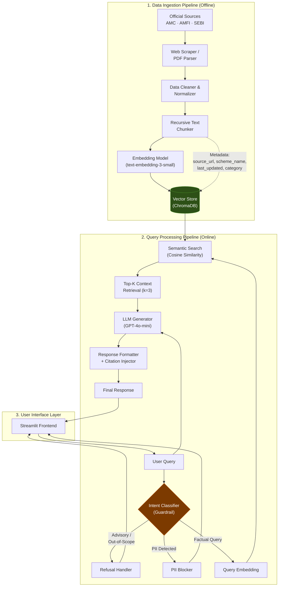
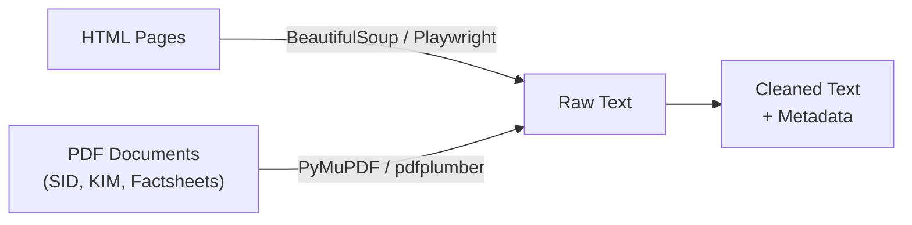
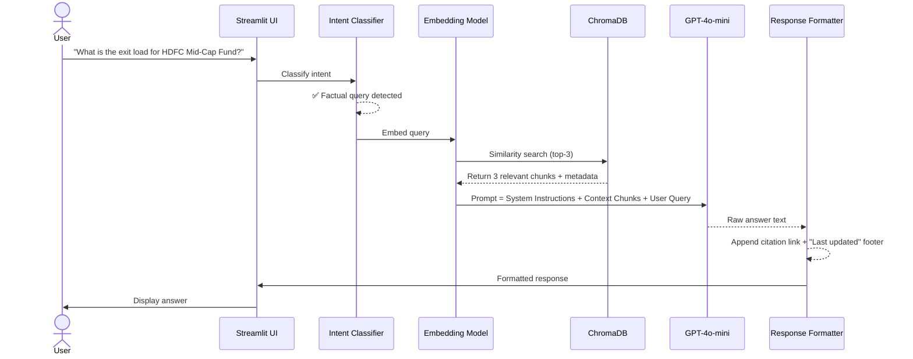
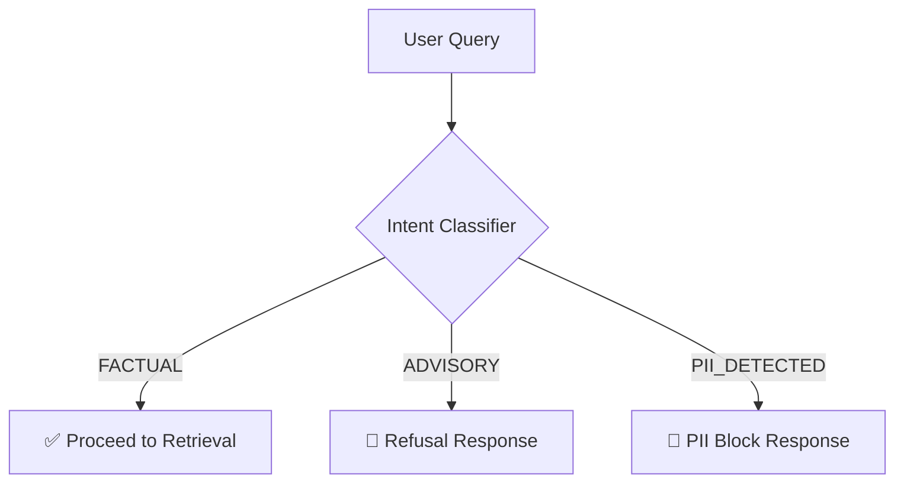
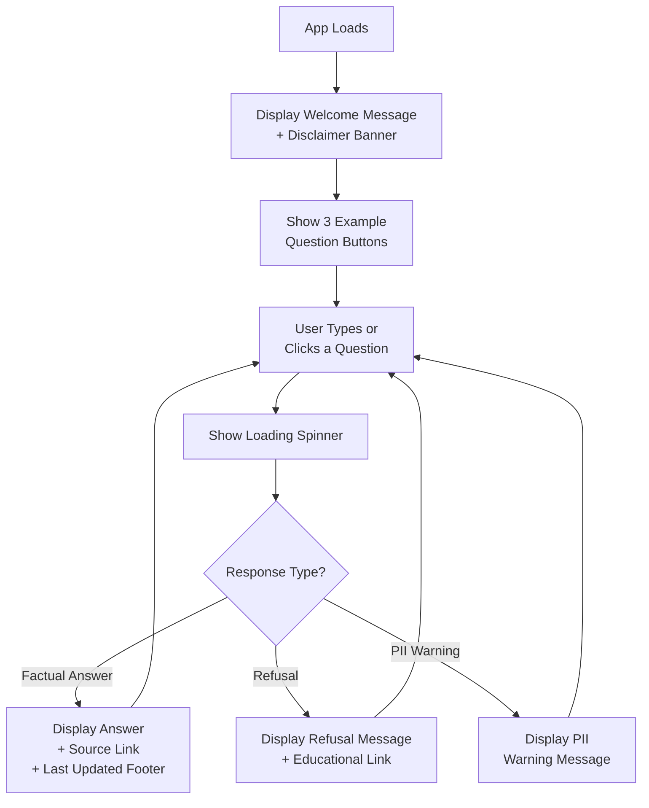
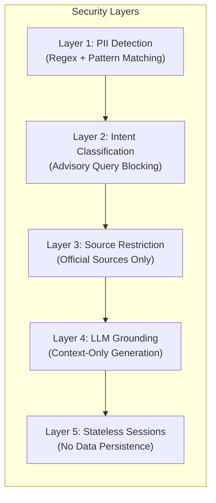
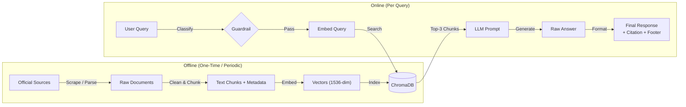

# Architecture Document: Mutual Fund FAQ Assistant (RAG System)

## 1. System Overview

This document describes the end-to-end architecture for a **facts-only Mutual Fund FAQ Assistant** built using Retrieval-Augmented Generation (RAG). The system answers objective, verifiable queries about HDFC mutual fund schemes by retrieving information exclusively from official public sources (AMC websites, AMFI, SEBI).

### 1.1 Design Principles

| Principle | Description |
|---|---|
| **Facts-Only** | Every response is grounded in retrieved documents. No opinions, advice, or hallucinated content. |
| **Source-Backed** | Every answer carries exactly one citation link and a "Last updated" footer. |
| **Privacy-First** | Zero PII collection — no PAN, Aadhaar, phone, email, OTP, or account numbers are ever requested or stored. |
| **Minimal & Transparent** | Clean UI with a visible disclaimer. Short responses (≤ 3 sentences). |
| **Stateless** | No user session history is persisted. Each query is independent. |

### 1.2 Core Pipelines

The system is composed of three distinct pipelines:

1. **Data Ingestion Pipeline** — Offline batch process to scrape, clean, chunk, embed, and index official documents.
2. **Query Processing Pipeline** — Online real-time flow handling guardrails, retrieval, generation, and formatting.
3. **User Interface Layer** — Minimal frontend for user interaction.

---

## 2. High-Level Architecture Diagram



---

## 3. Data Ingestion Pipeline (Offline)

### 3.1 Data Sources

The knowledge base is built exclusively from the following official sources:

| Source Type | Examples | Format |
|---|---|---|
| **AMC Website** | HDFC Mutual Fund scheme pages, SID, KIM | HTML, PDF |
| **Groww Scheme Pages** | Scheme details for the 5 selected funds | HTML |
| **AMFI** | NAV data, scheme categorization, investor education | HTML, CSV |
| **SEBI** | Regulatory circulars, ELSS guidelines | PDF, HTML |

**Selected Schemes (HDFC AMC):**

| # | Scheme Name | Category |
|---|---|---|
| 1 | HDFC Mid-Cap Fund Direct Growth | Mid-Cap |
| 2 | HDFC Small Cap Fund Direct Growth | Small-Cap |
| 3 | HDFC Gold ETF Fund of Fund Direct Plan Growth | Gold / FoF |
| 4 | HDFC Large Cap Fund Direct Growth | Large-Cap |
| 5 | HDFC ELSS Tax Saver Fund Direct Plan Growth | ELSS (Tax Saver) |

### 3.2 Data Extraction



- **HTML Scraping:** Use `BeautifulSoup` or `Playwright` to extract structured content from Groww scheme pages and AMC websites.
- **PDF Parsing:** Use `PyMuPDF` or `pdfplumber` to extract text from Scheme Information Documents (SID), Key Information Memorandums (KIM), and factsheets.
- **Metadata Capture:** For every extracted document, record:
  - `source_url` — exact URL of the page or document
  - `scheme_name` — name of the mutual fund scheme
  - `category` — fund category (Large-Cap, Mid-Cap, ELSS, etc.)
  - `last_updated` — date the source was last accessed/updated
  - `document_type` — SID, KIM, Factsheet, FAQ, etc.

### 3.3 Data Cleaning & Normalization

| Step | Description |
|---|---|
| Remove boilerplate | Strip navigation, headers, footers, cookie banners |
| Remove marketing copy | Eliminate promotional content and subjective language |
| Normalize formatting | Standardize whitespace, bullet points, tables to plain text |
| Deduplicate | Remove duplicate content across overlapping sources |
| Validate completeness | Ensure key facts (expense ratio, exit load, etc.) are present for each scheme |

### 3.4 Chunking Strategy

```
Strategy: Recursive Character Text Splitting
├── Primary Separator:  "\n\n" (section breaks)
├── Secondary Separator: "\n" (line breaks)
├── Chunk Size:          500 tokens
├── Chunk Overlap:       100 tokens
└── Metadata Preserved:  source_url, scheme_name, category, last_updated
```

**Why this approach:**
- Mutual fund facts are naturally organized by sections (Exit Load, Expense Ratio, SIP Details).
- 500-token chunks are large enough to contain a complete fact with context, but small enough to keep retrieval precise.
- 100-token overlap prevents facts from being split at chunk boundaries.

### 3.5 Embedding & Indexing

| Component | Choice | Rationale |
|---|---|---|
| **Embedding Model** | OpenAI `text-embedding-3-small` (1536 dims) | Cost-effective, strong semantic understanding, good for short factual content |
| **Vector Store** | ChromaDB (local) | Lightweight, zero-infra, persistent storage, metadata filtering support |
| **Distance Metric** | Cosine Similarity | Standard for normalized dense embeddings |

**Indexing process:**
1. Each chunk is embedded into a 1536-dimensional vector.
2. The vector, the raw chunk text, and all metadata fields are stored together in ChromaDB.
3. A collection is created per logical group (or a single collection with metadata filters).

---

## 4. Query Processing Pipeline (Online)

### 4.1 Pipeline Flow



### 4.2 Guardrail Layer (Intent Classifier)

The guardrail is the **first checkpoint** before any retrieval or generation occurs. It classifies the user query into one of three categories:



#### Classification Rules

| Category | Trigger Patterns | Action |
|---|---|---|
| `FACTUAL` | "What is the expense ratio…", "Exit load for…", "Minimum SIP amount…", "Benchmark index of…" | Proceed to retrieval pipeline |
| `ADVISORY` | "Should I invest…", "Which fund is better…", "Is this a good fund…", "Will returns increase…" | Return polite refusal + AMFI/SEBI educational link |
| `PII_DETECTED` | Contains patterns matching PAN, Aadhaar, phone numbers, email, OTP | Return PII warning, do not process further |
| `OUT_OF_SCOPE` | Queries about non-HDFC funds, unrelated topics | Return scope limitation message |

#### Refusal Response Template

```
I can only provide factual information about mutual fund schemes.
I'm unable to offer investment advice or recommendations.

For investment guidance, please consult a SEBI-registered advisor or visit:
https://www.amfiindia.com/investor-corner/knowledge-center.html
```

#### PII Block Response Template

```
For your safety, I cannot process queries containing personal information
such as PAN, Aadhaar, phone numbers, or account details.

Please rephrase your question with only scheme-related details.
```

### 4.3 Retrieval

| Parameter | Value | Rationale |
|---|---|---|
| **Top-K** | 3 | Balances context richness vs. noise for short factual answers |
| **Similarity Threshold** | 0.7 (cosine) | Filters out low-relevance chunks |
| **Metadata Filter** | Optional scheme-name filter | If the query mentions a specific scheme, filter to that scheme's chunks first |

**Retrieval Process:**
1. The user query is embedded using the same model used during ingestion.
2. ChromaDB performs a cosine similarity search against the indexed vectors.
3. The top-3 chunks above the similarity threshold are returned, along with their metadata.
4. If a specific scheme is mentioned in the query, metadata filtering is applied to narrow results.

### 4.4 Generation (LLM)

**Model:** OpenAI `gpt-4o-mini`

**System Prompt:**

```
You are a facts-only mutual fund FAQ assistant.

STRICT RULES:
1. Answer ONLY using the provided context. Do NOT use any outside knowledge.
2. Keep your response to a MAXIMUM of 3 sentences.
3. If the context does not contain the answer, say:
   "I don't have this information in my current sources."
4. NEVER provide investment advice, opinions, or recommendations.
5. NEVER compare fund performance or calculate returns.
6. Do NOT include the source link or footer — those will be added separately.

CONTEXT:
{retrieved_chunks}

USER QUESTION:
{user_query}
```

**Why `gpt-4o-mini`:**
- Strong instruction-following capability (critical for refusing advice).
- Low latency and cost for a lightweight FAQ use case.
- Sufficient quality for short, factual, grounded responses.

### 4.5 Response Formatting

Every final response follows this exact structure:

```
[LLM-generated answer — max 3 sentences]

Source: [source_url from top chunk metadata]
Last updated from sources: [last_updated date from metadata]
```

**Example Output:**

```
The exit load for HDFC Mid-Cap Fund (Direct Growth) is 1% if redeemed
within 1 year from the date of allotment. No exit load is charged for
redemptions after 1 year.

Source: https://www.hdfcfund.com/mutual-fund/equity/hdfc-mid-cap-opportunities-fund
Last updated from sources: 2026-08-15
```

---

## 5. User Interface Layer

### 5.1 Design Specifications

| Element | Specification |
|---|---|
| **Framework** | Streamlit |
| **Layout** | Single-page chat interface |
| **Welcome Message** | "Welcome to the Mutual Fund FAQ Assistant. Ask me any factual question about HDFC mutual fund schemes." |
| **Disclaimer Banner** | Persistent top banner: **"Facts-only. No investment advice."** |
| **Example Questions** | 3 clickable buttons |
| **Response Display** | Answer + Source link + Last updated footer |

### 5.2 Example Questions

1. "What is the expense ratio of HDFC Large Cap Fund?"
2. "What is the exit load for HDFC ELSS Tax Saver Fund?"
3. "What is the minimum SIP amount for HDFC Small Cap Fund?"

### 5.3 UI Flow



---

## 6. Project Directory Structure

```
RAG-Project/
├── problemStatement.md         # Problem definition
├── Architecture.md             # This document
├── README.md                   # Setup instructions & overview
├── requirements.txt            # Python dependencies
├── .env.example                # Environment variable template (API keys)
│
├── data/                       # Raw and processed data
│   ├── raw/                    # Scraped HTML, downloaded PDFs
│   │   ├── hdfc_midcap/
│   │   ├── hdfc_smallcap/
│   │   ├── hdfc_gold_fof/
│   │   ├── hdfc_largecap/
│   │   └── hdfc_elss/
│   └── processed/              # Cleaned text files ready for chunking
│       └── *.txt
│
├── scripts/                    # Data pipeline scripts
│   ├── scrape.py               # Web scraper for Groww / AMC pages
│   ├── parse_pdf.py            # PDF text extraction
│   ├── clean.py                # Data cleaning & normalization
│   ├── chunk.py                # Text chunking logic
│   └── ingest.py               # Embedding + ChromaDB indexing
│
├── src/                        # Core application source code
│   ├── __init__.py
│   ├── config.py               # Configuration constants & env loading
│   ├── guardrail.py            # Intent classifier & PII detector
│   ├── retriever.py            # ChromaDB query & retrieval logic
│   ├── generator.py            # LLM prompt construction & API call
│   ├── formatter.py            # Response formatting (citation + footer)
│   └── pipeline.py             # Orchestrates guardrail → retrieval → generation → formatting
│
├── vectorstore/                # ChromaDB persistent storage
│   └── chroma_db/
│
├── ui/                         # Frontend
│   └── app.py                  # Streamlit application
│
└── tests/                      # Test suite
    ├── test_guardrail.py       # Tests for intent classification & PII detection
    ├── test_retriever.py       # Tests for retrieval accuracy
    ├── test_formatter.py       # Tests for response formatting
    └── test_refusal.py         # Tests for advisory query refusal
```

---

## 7. Technology Stack

| Layer | Technology | Version | Purpose |
|---|---|---|---|
| **Language** | Python | 3.10+ | Core development language |
| **RAG Framework** | LangChain | Latest | Document loading, chunking, retrieval chain orchestration |
| **Embedding** | OpenAI `text-embedding-3-small` | — | Convert text to 1536-dim vectors |
| **LLM** | OpenAI `gpt-4o-mini` | — | Grounded answer generation |
| **Vector Store** | ChromaDB | Latest | Local persistent vector storage with metadata filtering |
| **Web Scraping** | BeautifulSoup4 + Requests | — | HTML content extraction |
| **PDF Parsing** | PyMuPDF (`fitz`) | — | PDF text extraction |
| **Frontend** | Streamlit | Latest | Minimal chat UI |
| **Env Management** | python-dotenv | — | API key management via `.env` |
| **Testing** | pytest | — | Unit and integration tests |

---

## 8. Security & Compliance Architecture



| Security Layer | What It Prevents |
|---|---|
| **PII Detection** | Blocks queries containing PAN, Aadhaar, phone numbers, email, OTPs, account numbers |
| **Intent Classification** | Blocks advisory, comparative, and recommendation-seeking queries |
| **Source Restriction** | Only official AMC/AMFI/SEBI content enters the vector store; no blogs or aggregators |
| **LLM Grounding** | System prompt forces the LLM to answer only from provided context |
| **Stateless Sessions** | No chat history, user data, or session state is persisted to any database |

---

## 9. Data Flow Summary



---

## 10. Known Limitations & Trade-offs

| Limitation | Impact | Mitigation |
|---|---|---|
| **Static corpus** | Data may become stale as AMCs update scheme details | Schedule periodic re-ingestion (monthly) |
| **Single AMC coverage** | Only HDFC schemes are supported | Document scope clearly in UI; expandable to other AMCs |
| **No multi-turn context** | Each query is independent; no follow-up awareness | Keep the system simple and stateless per requirements |
| **Embedding model ceiling** | Semantic search may miss highly specific or ambiguous queries | Tune chunk size, use metadata filters, consider hybrid search (BM25 + dense) in future |
| **LLM dependency** | Requires OpenAI API access and incurs per-query cost | `gpt-4o-mini` is cost-effective; can swap to open-source models if needed |
| **No authentication** | Open access to anyone with the URL | Acceptable for a public FAQ tool; add auth if deployed internally |

---

## 11. Future Enhancements (Out of Scope)

- **Hybrid Search:** Combine BM25 keyword search with dense vector search for better recall.
- **Multi-AMC Support:** Expand the corpus to include SBI, ICICI, Axis, and other AMCs.
- **Auto-Refresh Pipeline:** Scheduled scraping to keep the corpus up to date.
- **Evaluation Framework:** RAGAS or similar to measure retrieval accuracy, faithfulness, and answer relevance.
- **Deployment:** Dockerize the application and deploy on cloud (AWS/GCP/Azure).
- **Caching Layer:** Cache frequent queries to reduce LLM API calls and latency.
