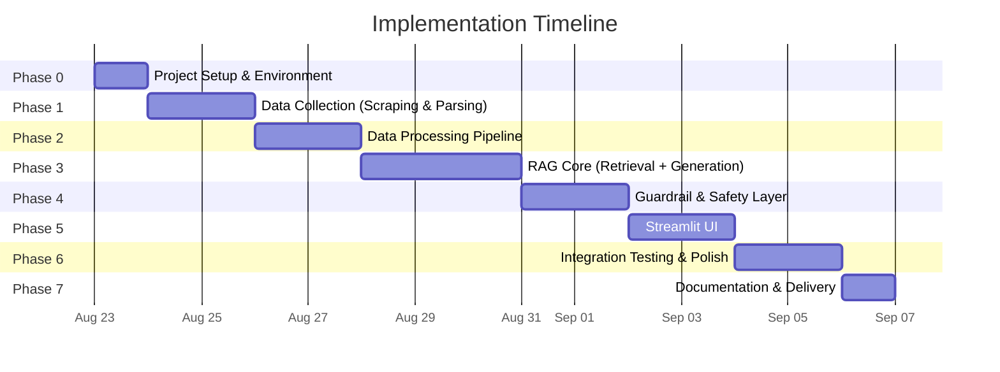
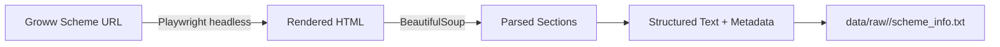
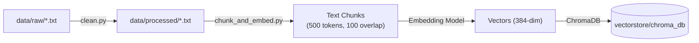
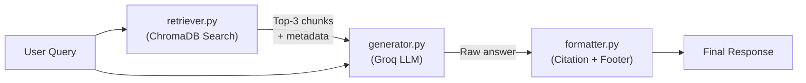
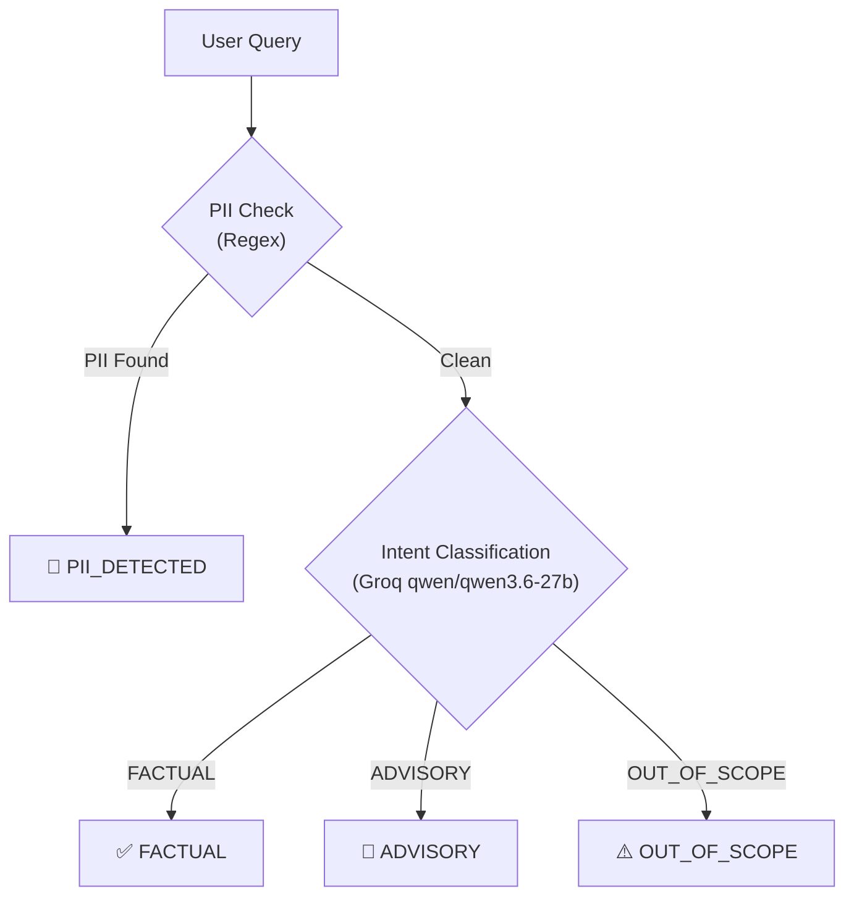

# Implementation Plan: Mutual Fund FAQ Assistant (RAG System)

> **LLM Provider:** Groq (using `openai/gpt-oss-120b` for generation, `qwen/qwen3.6-27b` for guardrail classification)
> **Embedding Provider:** HuggingFace `sentence-transformers/all-MiniLM-L6-v2` (free, local) — or OpenAI `text-embedding-3-small` as an alternative
> **Vector Store:** ChromaDB (local, persistent)
> **Frontend:** Streamlit

---

## Phase Overview



| Phase | Name | Duration | Key Output |
|---|---|---|---|
| **0** | Project Setup & Environment | 1 day | Directory structure, virtual env, dependencies, `.env` config |
| **1** | Data Collection | 2 days | Raw HTML/text data for all 5 HDFC schemes |
| **2** | Data Processing Pipeline | 2 days | Cleaned, chunked, embedded & indexed data in ChromaDB |
| **3** | RAG Core Engine | 3 days | Working retrieval + Groq LLM generation pipeline |
| **4** | Guardrail & Safety Layer | 2 days | Intent classifier, PII blocker, refusal handler |
| **5** | Streamlit UI | 2 days | Fully functional chat interface |
| **6** | Integration Testing & Polish | 2 days | End-to-end tested, edge-case hardened system |
| **7** | Documentation & Delivery | 1 day | README, demo walkthrough, known limitations |

---

## Phase 0: Project Setup & Environment

### 0.1 Objectives
- Initialize the project directory structure
- Set up Python virtual environment and install all dependencies
- Configure environment variables for Groq API

### 0.2 Directory Structure

```
RAG-Project/
├── docs/
│   ├── problemStatement.md
│   ├── Architecture.md
│   └── implementation-plan.md      ← This document
├── data/
│   ├── raw/                        # Scraped HTML & text files
│   │   ├── hdfc_midcap/
│   │   ├── hdfc_smallcap/
│   │   ├── hdfc_gold_fof/
│   │   ├── hdfc_largecap/
│   │   └── hdfc_elss/
│   └── processed/                  # Cleaned, ready-to-chunk text files
│       └── *.txt
├── scripts/
│   ├── scrape.py                   # Web scraper
│   ├── clean.py                    # Data cleaning & normalization
│   ├── chunk_and_embed.py          # Chunking + embedding + ChromaDB ingestion
│   └── validate_vectorstore.py     # Verify ingestion quality
├── src/
│   ├── __init__.py
│   ├── config.py                   # Env vars, constants, model configs
│   ├── guardrail.py                # Intent classification + PII detection
│   ├── retriever.py                # ChromaDB similarity search
│   ├── generator.py                # Groq LLM prompt construction & API call
│   ├── formatter.py                # Citation + footer injection
│   └── pipeline.py                 # Orchestrator: guardrail → retriever → generator → formatter
├── vectorstore/
│   └── chroma_db/                  # ChromaDB persistent storage
├── ui/
│   └── app.py                      # Streamlit application
├── tests/
│   ├── test_guardrail.py
│   ├── test_retriever.py
│   ├── test_generator.py
│   ├── test_formatter.py
│   └── test_pipeline.py
├── .env.example
├── .gitignore
├── requirements.txt
└── README.md
```

### 0.3 Dependencies (`requirements.txt`)

```
# Core
langchain>=0.2.0
langchain-community>=0.2.0
langchain-groq>=0.1.0
chromadb>=0.5.0
sentence-transformers>=3.0.0

# Data Collection
beautifulsoup4>=4.12.0
requests>=2.31.0
playwright>=1.40.0

# PDF (if needed later)
pymupdf>=1.24.0

# Frontend
streamlit>=1.35.0

# Utilities
python-dotenv>=1.0.0
tiktoken>=0.7.0

# Testing
pytest>=8.0.0
```

### 0.4 Environment Variables (`.env.example`)

```env
# Groq API
GROQ_API_KEY=gsk_your_groq_api_key_here

# Model Configuration
GROQ_GENERATION_MODEL=openai/gpt-oss-120b
GROQ_GUARDRAIL_MODEL=qwen/qwen3.6-27b

# Embedding (local HuggingFace model — no API key needed)
EMBEDDING_MODEL=sentence-transformers/all-MiniLM-L6-v2

# ChromaDB
CHROMA_PERSIST_DIR=./vectorstore/chroma_db
CHROMA_COLLECTION_NAME=mutual_fund_faq

# Retrieval
RETRIEVAL_TOP_K=3
SIMILARITY_THRESHOLD=0.7
```

### 0.5 Tasks

| # | Task | Command / Action |
|---|---|---|
| 1 | Create directory structure | `mkdir` for all folders |
| 2 | Create virtual environment | `python -m venv venv` |
| 3 | Activate & install deps | `venv\Scripts\activate` → `pip install -r requirements.txt` |
| 4 | Install Playwright browsers | `playwright install chromium` |
| 5 | Create `.env` from `.env.example` | Add your Groq API key |
| 6 | Create `.gitignore` | Exclude `venv/`, `.env`, `vectorstore/`, `__pycache__/` |
| 7 | Verify Groq connectivity | Quick test script calling Groq API |

### 0.6 Groq API Verification Script

```python
# scripts/verify_groq.py
from groq import Groq
import os
from dotenv import load_dotenv

load_dotenv()
client = Groq(api_key=os.getenv("GROQ_API_KEY"))

response = client.chat.completions.create(
    model="openai/gpt-oss-120b",
    messages=[{"role": "user", "content": "Say 'Groq is connected!' in one sentence."}],
    max_tokens=50,
)
print(response.choices[0].message.content)
```

### 0.7 Exit Criteria
- [ ] All directories created
- [ ] `pip install -r requirements.txt` succeeds without errors
- [ ] Groq API test script returns a valid response
- [ ] `.env` configured with a valid `GROQ_API_KEY`

---

## Phase 1: Data Collection (Scraping & Parsing)

### 1.1 Objectives
- Scrape factual content from Groww scheme pages for all 5 HDFC schemes
- Extract structured data: expense ratio, exit load, SIP details, benchmark, riskometer, etc.
- Store raw data with metadata

### 1.2 Target URLs

| # | Scheme | URL |
|---|---|---|
| 1 | HDFC Mid-Cap Fund | `https://groww.in/mutual-funds/hdfc-mid-cap-fund-direct-growth` |
| 2 | HDFC Small Cap Fund | `https://groww.in/mutual-funds/hdfc-small-cap-fund-direct-growth` |
| 3 | HDFC Gold ETF FoF | `https://groww.in/mutual-funds/hdfc-gold-etf-fund-of-fund-direct-plan-growth` |
| 4 | HDFC Large Cap Fund | `https://groww.in/mutual-funds/hdfc-large-cap-fund-direct-growth` |
| 5 | HDFC ELSS Tax Saver | `https://groww.in/mutual-funds/hdfc-elss-tax-saver-fund-direct-plan-growth` |

### 1.3 Data Points to Extract Per Scheme

| Data Point | Example Value |
|---|---|
| Fund Name | HDFC Mid-Cap Opportunities Fund |
| Category | Mid-Cap |
| Expense Ratio (Direct) | 0.75% |
| Exit Load | 1% if redeemed within 1 year |
| Minimum SIP Amount | ₹500 |
| Minimum Lumpsum | ₹5,000 |
| Lock-in Period | Nil (3 years for ELSS) |
| Benchmark Index | Nifty Midcap 150 TRI |
| Riskometer | Very High |
| Fund Manager | Name(s) |
| AUM | ₹X,XXX Cr |
| NAV | ₹XX.XX |
| Fund House | HDFC Asset Management |
| Launch Date | DD-MMM-YYYY |
| Scheme Information | SID link if available |

### 1.4 Scraping Approach



**Why Playwright over Requests:**
- Groww pages are JavaScript-rendered SPAs. `requests + BeautifulSoup` alone won't capture dynamically loaded content.
- Playwright renders the full page in a headless Chromium browser before extracting HTML.

### 1.5 Script: `scripts/scrape.py`

**Pseudocode:**
```
for each scheme_url in TARGET_URLS:
    1. Launch Playwright headless browser
    2. Navigate to scheme_url, wait for content to load
    3. Extract full page HTML
    4. Parse with BeautifulSoup to extract:
       - Key facts section (expense ratio, exit load, SIP, etc.)
       - Fund details section
       - Any FAQ or description text
    5. Save to data/raw/<scheme_slug>/scheme_info.txt
    6. Save metadata (source_url, scrape_date) to data/raw/<scheme_slug>/metadata.json
```

### 1.6 Supplementary Sources (Manual / Optional)

| Source | Content | Action |
|---|---|---|
| HDFC MF Official Site | SID PDFs, KIM | Download PDFs → `data/raw/<scheme>/` |
| AMFI India | Scheme categories, NAV history | Scrape relevant pages |
| SEBI | ELSS guidelines, regulatory circulars | Download relevant PDFs |

### 1.7 Exit Criteria
- [ ] Raw text files exist for all 5 schemes in `data/raw/`
- [x] Each file contains key factual data points (expense ratio, exit load, SIP, benchmark, etc.)
- [x] Metadata JSON recorded for each scheme (source URL, date scraped)
- [x] Manual review confirms data accuracy against live Groww pages

---

## Phase 2: Data Processing Pipeline

### 2.1 Objectives
- Clean and normalize raw scraped data
- Split into semantically meaningful chunks
- Embed chunks and index into ChromaDB

### 2.2 Pipeline Flow



### 2.3 Step 1: Data Cleaning (`scripts/clean.py`)

| Cleaning Rule | Description |
|---|---|
| Remove boilerplate | Strip nav menus, cookie banners, ads, footers |
| Remove marketing language | "Invest now!", "Start your journey" — subjective content |
| Normalize whitespace | Collapse multiple spaces/newlines |
| Standardize formatting | Convert HTML tables to readable text, normalize bullet lists |
| Deduplicate | Remove identical paragraphs across overlapping sections |
| Add section headers | Ensure each fact block has a clear heading (e.g., "Exit Load:", "Expense Ratio:") |

**Output:** One clean `.txt` file per scheme in `data/processed/`

### 2.4 Step 2: Chunking (`scripts/chunk_and_embed.py`)

| Parameter | Value |
|---|---|
| **Splitter** | `RecursiveCharacterTextSplitter` (LangChain) |
| **Chunk Size** | 1000 characters |
| **Chunk Overlap** | 200 characters |
| **Primary Separator** | `"\n"` (line breaks, as the processed data contains no `\n\n` breaks) |
| **Secondary Separator** | `" "` (spaces) |

**Reasoning for Strategy Update:**
The processed data consists of dense, single-newline separated key-value pairs and 4-line repeating tabular blocks (e.g. Holdings: Name, Sector, Type, %).
- `\n\n` is removed since `clean.py` collapsed empty lines.
- **Chunk size (1000)** is increased to ensure enough surrounding list items are captured in a single chunk to provide context.
- **Chunk overlap (200)** ensures that any 4-line holding blocks that get split at a chunk boundary are fully preserved in the overlapping adjacent chunk.

**Metadata attached to each chunk:**

```json
{
  "source_url": "https://groww.in/mutual-funds/hdfc-mid-cap-fund-direct-growth",
  "scheme_name": "HDFC Mid-Cap Fund Direct Growth",
  "category": "Mid-Cap",
  "last_updated": "2026-08-23",
  "document_type": "scheme_page"
}
```

### 2.5 Step 3: Embedding

| Component | Choice | Details |
|---|---|---|
| **Model** | `sentence-transformers/all-MiniLM-L6-v2` | 384 dimensions, runs locally, no API key needed |
| **Alternative** | OpenAI `text-embedding-3-small` | 1536 dims, requires API key, higher quality |
| **Framework** | LangChain `HuggingFaceEmbeddings` | Wraps the sentence-transformer model |

**Why HuggingFace (local) as default:**
- **Free** — no per-call cost, ideal for a project context.
- **Fast** — runs locally, no network latency for embedding.
- **Good enough** — `all-MiniLM-L6-v2` performs well on short factual text retrieval.

### 2.6 Step 4: ChromaDB Indexing

```python
# Pseudocode for ingestion
from langchain_community.vectorstores import Chroma
from langchain_community.embeddings import HuggingFaceEmbeddings

embeddings = HuggingFaceEmbeddings(model_name="sentence-transformers/all-MiniLM-L6-v2")

vectorstore = Chroma.from_documents(
    documents=chunked_docs_with_metadata,
    embedding=embeddings,
    persist_directory="./vectorstore/chroma_db",
    collection_name="mutual_fund_faq",
)
```

### 2.7 Validation Script (`scripts/validate_vectorstore.py`)

Run test queries to verify the vector store is populated and returning relevant results:

```python
test_queries = [
    "What is the expense ratio of HDFC Mid-Cap Fund?",
    "Exit load for HDFC ELSS Tax Saver Fund",
    "Minimum SIP amount for HDFC Small Cap Fund",
    "Benchmark index for HDFC Large Cap Fund",
    "What is the riskometer category of HDFC Gold ETF Fund of Fund?",
]
# For each query: embed → search → print top-3 results with scores
```

### 2.8 Exit Criteria
- [ ] Cleaned text files exist in `data/processed/` for all 5 schemes
- [ ] ChromaDB collection `mutual_fund_faq` is populated
- [ ] `validate_vectorstore.py` returns relevant chunks for all 5 test queries
- [x] Each chunk has complete metadata (source_url, scheme_name, category, last_updated)

---

## Phase 3: RAG Core Engine (Retrieval + Generation)

### 3.1 Objectives
- Build the retrieval module to query ChromaDB
- Build the generation module using Groq API (`openai/gpt-oss-120b`)
- Build the response formatter (citation + footer)
- Wire them together in the pipeline orchestrator

### 3.2 Component Breakdown



### 3.3 Module: `src/config.py`

```python
# Centralized configuration
import os
from dotenv import load_dotenv

load_dotenv()

# Groq
GROQ_API_KEY = os.getenv("GROQ_API_KEY")
GROQ_GENERATION_MODEL = os.getenv("GROQ_GENERATION_MODEL", "openai/gpt-oss-120b")
GROQ_GUARDRAIL_MODEL = os.getenv("GROQ_GUARDRAIL_MODEL", "qwen/qwen3.6-27b")

# Embedding
EMBEDDING_MODEL = os.getenv("EMBEDDING_MODEL", "sentence-transformers/all-MiniLM-L6-v2")

# ChromaDB
CHROMA_PERSIST_DIR = os.getenv("CHROMA_PERSIST_DIR", "./vectorstore/chroma_db")
CHROMA_COLLECTION_NAME = os.getenv("CHROMA_COLLECTION_NAME", "mutual_fund_faq")

# Retrieval
RETRIEVAL_TOP_K = int(os.getenv("RETRIEVAL_TOP_K", "5")) # Increased to 5 to handle tabular data spread across chunks
RETRIEVAL_SEARCH_TYPE = os.getenv("RETRIEVAL_SEARCH_TYPE", "mmr") # Use Maximum Marginal Relevance for diversity
SIMILARITY_THRESHOLD = float(os.getenv("SIMILARITY_THRESHOLD", "0.7"))
```

### 3.4 Module: `src/retriever.py`

**Responsibilities:**
- Load the persisted ChromaDB collection
- Accept a user query string
- Implement an **Advanced Retrieval Strategy**:
  1. **Query Routing / Metadata Extraction**: Extract the target fund name from the user's query (either via regex, exact string matching against the 5 known slugs, or a fast LLM call) to build a ChromaDB `where` filter. This prevents cross-fund data contamination.
  2. **Max Marginal Relevance (MMR)**: Use MMR instead of standard similarity search to ensure diversity. If a user asks for "Holdings", MMR ensures we don't just get 5 identical slices of the holdings table, but a diverse set of chunks.
- Return top-K relevant chunks with metadata and similarity scores

**Key Method Signature:**
```python
def retrieve(query: str, scheme_filter: str | None = None) -> list[dict]:
    """
    Returns list of dicts:
    [
        {
            "content": "chunk text...",
            "metadata": {"source_url": "...", "scheme_name": "...", "last_updated": "..."},
            "score": 0.85
        },
        ...
    ]
    """
```

### 3.5 Module: `src/generator.py`

**Responsibilities:**
- Construct the prompt with system instructions + retrieved context + user query
- Call Groq API using `langchain-groq` or the `groq` Python SDK
- Return the raw LLM-generated answer

**System Prompt for Groq:**

```
You are a facts-only mutual fund FAQ assistant.

STRICT RULES:
1. Answer ONLY using the provided context. Do NOT use any outside knowledge.
2. Keep your response to a MAXIMUM of 3 sentences.
3. If the context does not contain the answer, respond exactly with:
   "I don't have this information in my current sources."
4. NEVER provide investment advice, opinions, or recommendations.
5. NEVER compare fund performance or calculate returns.
6. Do NOT include any source links or date footers in your answer.

CONTEXT:
{context}

USER QUESTION:
{question}
```

**Groq API Call (using `langchain-groq`):**
```python
from langchain_groq import ChatGroq

llm = ChatGroq(
    model=GROQ_GENERATION_MODEL,        # "openai/gpt-oss-120b"
    api_key=GROQ_API_KEY,
    temperature=0,                        # Deterministic for factual answers
    max_tokens=256,                       # Short responses only
)
```

**Why Groq:**
- **Ultra-fast inference** — Groq's LPU delivers responses in ~100–300ms, far faster than typical API providers.
- **Free tier available** — Generous rate limits for development and demo usage.
- **Strong open-source models** — `openai/gpt-oss-120b` has excellent instruction-following for grounded, factual tasks.

### 3.6 Module: `src/formatter.py`

**Responsibilities:**
- Take the raw LLM answer + the metadata from the top retrieved chunk
- Append exactly one source citation link
- Append the "Last updated from sources: <date>" footer

**Output Format:**
```
[LLM answer — max 3 sentences]

Source: [source_url]
Last updated from sources: [last_updated]
```

### 3.7 Module: `src/pipeline.py`

**Responsibilities:**
- Orchestrate the full query flow: `query → retriever → generator → formatter`
- (Guardrail integration added in Phase 4)

**Pseudocode:**
```python
def process_query(user_query: str) -> str:
    # Step 1: Retrieve relevant chunks
    results = retriever.retrieve(user_query)

    if not results:
        return "I don't have this information in my current sources."

    # Step 2: Generate answer via Groq
    context = "\n\n".join([r["content"] for r in results])
    raw_answer = generator.generate(context, user_query)

    # Step 3: Format response with citation
    top_metadata = results[0]["metadata"]
    formatted = formatter.format_response(raw_answer, top_metadata)

    return formatted
```

### 3.8 Exit Criteria
- [x] `retriever.py` returns relevant chunks for test queries
- [x] `generator.py` produces grounded, ≤3-sentence answers via Groq
- [x] `formatter.py` correctly appends citation + footer
- [x] `pipeline.py` end-to-end returns correct, formatted responses
- [x] LLM refuses to answer when context is insufficient (returns "I don't have this information…")

---

## Phase 4: Guardrail & Safety Layer

### 4.1 Objectives
- Build intent classifier to detect advisory, PII, and out-of-scope queries
- Integrate guardrail as the first step in the pipeline
- Ensure all refusal responses are polite and include educational links

### 4.2 Module: `src/guardrail.py`



### 4.3 Layer 1: PII Detection (Regex-Based)

Fast, deterministic regex patterns — runs **before** any LLM call.

| PII Type | Regex Pattern |
|---|---|
| **PAN** | `[A-Z]{5}[0-9]{4}[A-Z]{1}` |
| **Aadhaar** | `[0-9]{4}\s?[0-9]{4}\s?[0-9]{4}` |
| **Phone (India)** | `(\+91[\s-]?)?[6-9][0-9]{9}` |
| **Email** | `[a-zA-Z0-9._%+-]+@[a-zA-Z0-9.-]+\.[a-zA-Z]{2,}` |
| **OTP** | `\b[0-9]{4,6}\b` (in context of "OTP", "verification code") |
| **Account Number** | `\b[0-9]{9,18}\b` (in context of "account", "folio") |

**Response if PII detected:**
```
For your safety, I cannot process queries containing personal information
such as PAN, Aadhaar, phone numbers, or account details.

Please rephrase your question with only scheme-related details.
```

### 4.4 Layer 2: Intent Classification (LLM-Based)

Uses Groq with `qwen/qwen3.6-27b` (fast, cheap) for intent classification:

```python
GUARDRAIL_PROMPT = """
Classify the following user query into exactly one category.
Respond with ONLY the category name, nothing else.

Categories:
- FACTUAL: Questions asking for specific facts about mutual fund schemes
  (expense ratio, exit load, SIP amount, benchmark, riskometer, lock-in, NAV, AUM, fund manager)
- ADVISORY: Questions seeking investment advice, opinions, recommendations,
  comparisons, or return predictions
- OUT_OF_SCOPE: Questions unrelated to HDFC mutual fund schemes

Query: "{user_query}"

Category:
"""
```

**Why a separate, smaller model for guardrail:**
- `qwen/qwen3.6-27b` is ~10x faster and cheaper than `llama-3.3-70b`.
- Classification is a simple task; a large model is overkill.
- Keeps total latency low (guardrail + generation still under 500ms on Groq).

### 4.5 Refusal Response Templates

```python
REFUSAL_RESPONSES = {
    "ADVISORY": (
        "I can only provide factual information about mutual fund schemes. "
        "I'm unable to offer investment advice or recommendations.\n\n"
        "For investment guidance, please consult a SEBI-registered advisor or visit:\n"
        "https://www.amfiindia.com/investor-corner/knowledge-center.html"
    ),
    "PII_DETECTED": (
        "For your safety, I cannot process queries containing personal information "
        "such as PAN, Aadhaar, phone numbers, or account details.\n\n"
        "Please rephrase your question with only scheme-related details."
    ),
    "OUT_OF_SCOPE": (
        "I can only answer questions about HDFC mutual fund schemes covered in my knowledge base. "
        "Please try asking about one of the supported schemes:\n"
        "• HDFC Mid-Cap Fund\n• HDFC Small Cap Fund\n• HDFC Gold ETF FoF\n"
        "• HDFC Large Cap Fund\n• HDFC ELSS Tax Saver Fund"
    ),
}
```

### 4.6 Pipeline Integration

Update `src/pipeline.py`:

```python
def process_query(user_query: str) -> str:
    # Step 0: Guardrail
    intent = guardrail.classify(user_query)

    if intent != "FACTUAL":
        return guardrail.get_refusal_response(intent)

    # Step 1–3: Retrieve → Generate → Format (unchanged)
    ...
```

### 4.7 Exit Criteria
- [x] PII regex catches PAN, Aadhaar, phone, email patterns
- [x] Intent classifier correctly labels: factual, advisory, out-of-scope queries
- [x] Refusal responses are polite and include educational links
- [x] Pipeline correctly routes queries through guardrail first
- [x] Test suite in `tests/test_guardrail.py` passes all cases

### 4.8 Test Cases (`tests/test_guardrail.py`)

| # | Query | Expected |
|---|---|---|
| 1 | "What is the expense ratio of HDFC Mid-Cap Fund?" | `FACTUAL` |
| 2 | "Exit load for HDFC ELSS Tax Saver" | `FACTUAL` |
| 3 | "Should I invest in HDFC Small Cap Fund?" | `ADVISORY` |
| 4 | "Which fund is better — HDFC Large Cap or Mid Cap?" | `ADVISORY` |
| 5 | "Will this fund give good returns?" | `ADVISORY` |
| 6 | "My PAN is ABCDE1234F, check my investment" | `PII_DETECTED` |
| 7 | "My phone is 9876543210" | `PII_DETECTED` |
| 8 | "Tell me about SBI Blue Chip Fund" | `OUT_OF_SCOPE` |
| 9 | "What is the weather today?" | `OUT_OF_SCOPE` |
| 10 | "Minimum SIP amount for HDFC Gold ETF Fund of Fund" | `FACTUAL` |

---

## Phase 5: Streamlit UI

### 5.1 Objectives
- Build a clean, minimal chat interface
- Display disclaimer banner, welcome message, and example questions
- Show formatted responses with citations and footers

### 5.2 UI Wireframe

```
┌──────────────────────────────────────────────────────────────┐
│  ⚠️  Facts-only. No investment advice.                       │
├──────────────────────────────────────────────────────────────┤
│                                                              │
│  🏦 Mutual Fund FAQ Assistant                                │
│  Welcome! Ask me any factual question about HDFC mutual      │
│  fund schemes.                                               │
│                                                              │
│  Try these examples:                                         │
│  ┌─────────────────────────────────────────────────────┐     │
│  │ What is the expense ratio of HDFC Large Cap Fund?   │     │
│  ├─────────────────────────────────────────────────────┤     │
│  │ What is the exit load for HDFC ELSS Tax Saver Fund? │     │
│  ├─────────────────────────────────────────────────────┤     │
│  │ Minimum SIP amount for HDFC Small Cap Fund?         │     │
│  └─────────────────────────────────────────────────────┘     │
│                                                              │
│  ─────────────── Chat History ───────────────                │
│                                                              │
│  👤 User: What is the exit load for HDFC Mid-Cap Fund?       │
│                                                              │
│  🤖 Assistant:                                               │
│  The exit load for HDFC Mid-Cap Fund (Direct Growth) is      │
│  1% if redeemed within 1 year from the date of allotment.    │
│  No exit load is charged for redemptions after 1 year.       │
│                                                              │
│  📎 Source: https://groww.in/mutual-funds/hdfc-mid-cap-...   │
│  🕐 Last updated from sources: 2026-08-23                   │
│                                                              │
├──────────────────────────────────────────────────────────────┤
│  💬 Ask a question about HDFC mutual fund schemes...    [→]  │
└──────────────────────────────────────────────────────────────┘
```

### 5.3 Key Streamlit Components

| Component | Implementation |
|---|---|
| **Disclaimer Banner** | `st.warning("⚠️ Facts-only. No investment advice.")` — always visible at top |
| **Welcome Message** | `st.title()` + `st.markdown()` |
| **Example Buttons** | 3x `st.button()` — clicking fills the chat input |
| **Chat Interface** | `st.chat_message()` for user/assistant bubbles |
| **Input** | `st.chat_input()` at bottom |
| **Loading State** | `st.spinner("Searching knowledge base...")` |
| **Session State** | `st.session_state.messages` — list of `{"role", "content"}` for chat history display (not persisted to any DB) |

### 5.4 Script: `ui/app.py` — Pseudocode

```python
import streamlit as st
from src.pipeline import process_query

st.set_page_config(page_title="MF FAQ Assistant", page_icon="🏦")
st.warning("⚠️ Facts-only. No investment advice.")
st.title("🏦 Mutual Fund FAQ Assistant")

# Example questions as buttons
examples = [
    "What is the expense ratio of HDFC Large Cap Fund?",
    "What is the exit load for HDFC ELSS Tax Saver Fund?",
    "Minimum SIP amount for HDFC Small Cap Fund?",
]
for q in examples:
    if st.button(q):
        st.session_state.pending_query = q

# Chat history display
for msg in st.session_state.get("messages", []):
    with st.chat_message(msg["role"]):
        st.markdown(msg["content"])

# Chat input
user_input = st.chat_input("Ask a question about HDFC mutual fund schemes...")
query = user_input or st.session_state.pop("pending_query", None)

if query:
    # Display user message
    st.chat_message("user").markdown(query)
    st.session_state.messages.append({"role": "user", "content": query})

    # Process and display response
    with st.spinner("Searching knowledge base..."):
        response = process_query(query)

    st.chat_message("assistant").markdown(response)
    st.session_state.messages.append({"role": "assistant", "content": response})
```

### 5.5 Exit Criteria
- [x] Streamlit app launches without errors (`streamlit run ui/app.py`)
- [x] Disclaimer banner is always visible
- [x] Example question buttons populate the chat
- [x] Factual queries display answer + source link + date footer
- [x] Advisory queries display polite refusal message
- [x] PII queries display safety warning
- [x] Chat history is displayed within the session (not persisted)

---

## Phase 5.1: Premium Frontend Design (Current)

### 5.1.1 Objective
Transform the basic Streamlit interface into a premium, "wow-factor" design using advanced styling techniques without migrating to a completely new frontend framework.

> [!NOTE]
> Streamlit natively looks very basic. To achieve a modern, vibrant web app feel, we must inject custom CSS and leverage Streamlit's theming engine.

### 5.1.2 Proposed Changes
#### [NEW] `ui/.streamlit/config.toml`
Create a native Streamlit theme:
- Switch to a dark or custom light theme.
- Define a primary color palette (e.g., vibrant blue or purple).
- Change the background color and secondary background color.
- Set a modern font (e.g., `sans serif`).

#### [NEW] `ui/style.css`
Inject advanced CSS via `st.markdown(unsafe_allow_html=True)` to override default Streamlit limitations:
- **Glassmorphism**: Add translucent backgrounds and blur effects to chat bubbles.
- **Typography**: Import Google Fonts (e.g., Inter or Roboto).
- **Animations**: Add subtle hover micro-animations to buttons and chat inputs.
- **Gradients**: Apply a beautiful background gradient to the entire app instead of a flat color.
- **Component Hiding**: Hide the default Streamlit header, footer, and "Deploy" button for a clean, app-like feel.

#### [MODIFY] `ui/app.py`
- Load and inject `ui/style.css`.
- Reorganize the layout using `st.columns` and `st.container` to center the chat window.
- Add rich HTML/Markdown for the welcome message to make it visually striking.

### 5.1.3 Open Questions
> [!IMPORTANT]
> **Streamlit Limitations**: Even with heavy CSS, Streamlit remains a data app framework, not a full frontend framework. Interactions will always require a server round-trip, and complex layouts (like floating sidebars or complex animations) are difficult. 
> 
> **Are you okay with pushing Streamlit to its absolute visual limits via CSS, or would you prefer we abandon Streamlit entirely and build a separate React + Vite frontend for maximum control?** (I recommend sticking to Streamlit with custom CSS first as it keeps our Python-only stack intact and is much faster to build).

### 5.1.4 Exit Criteria
- [x] Custom CSS is injected and overrides standard Streamlit styling.
- [x] A custom theme is applied via `config.toml`.
- [x] The app features a premium look (gradients, custom fonts, glassmorphism).
- [x] The Streamlit top bar and footer are hidden.

---

## Phase 6: Decoupled Architecture (Vercel + Railway)

### 6.1 Objectives
Migrate away from the monolithic Streamlit application to a modern decoupled architecture:
1. **Backend**: A FastAPI server hosted on Railway that exposes the RAG engine.
2. **Frontend**: A Next.js (React) application hosted on Vercel with a premium UI.

### 6.2 Proposed Changes

#### Backend (Railway)
- [NEW] `api/main.py`: Create a FastAPI application with a `POST /api/chat` endpoint that calls our existing `process_query` function.
- [NEW] `Procfile` / `railway.json`: Deployment configuration for Railway.
- [MODIFY] `requirements.txt`: Add `fastapi` and `uvicorn`. Ensure all necessary env vars are documented.

#### Frontend (Vercel)
- [NEW] `frontend/`: Initialize a Next.js application using `npx create-next-app@latest`.
- [NEW] `frontend/src/app/page.tsx`: Implement the modern chat UI (Tailwind CSS, clean animations).
- [NEW] `frontend/next.config.js`: Setup API proxy for local development.

### 6.3 Deployment & Database Strategy
- **Deployment via GitHub**: We will prepare the project for deployment via GitHub. You will push this codebase to a GitHub repository, and then connect that repository to both Vercel and Railway for continuous deployment.
- **ChromaDB Persistence on Railway**: Railway instances are ephemeral. We will configure Railway to use a **Persistent Volume**. We will map a Railway volume to our `./vectorstore` directory, ensuring our database remains intact across deployments.

### 6.4 Exit Criteria
- [x] Run FastAPI backend locally and test via `curl` or Swagger UI (`/docs`).
- [x] Run Next.js frontend locally and verify end-to-end chat flow.
- [x] Ensure all API routes use relative/configurable URLs for easy production deployment.

---

## Phase 7: Integration Testing & Polish

### 7.1 Objectives
- Write comprehensive README
- Document known limitations
- Prepare for handoff / demo

### 7.2 README.md Structure

```markdown
# Mutual Fund FAQ Assistant

## Overview
[Brief description — facts-only RAG assistant for HDFC mutual fund schemes]

## Features
- Facts-only answers with source citations
- Guardrail: refuses advisory and PII queries
- Covers 5 HDFC schemes across diverse categories

## Tech Stack
| Component | Technology |
|---|---|
| LLM | Groq (openai/gpt-oss-120b) |
| Embeddings | HuggingFace all-MiniLM-L6-v2 |
| Vector Store | ChromaDB |
| Frontend | Streamlit |
| Framework | LangChain |

## Setup Instructions
1. Clone the repository
2. Create virtual environment
3. Install dependencies
4. Add Groq API key to .env
5. Run data ingestion pipeline
6. Launch Streamlit app

## Supported Schemes
[Table of 5 schemes]

## Disclaimer
"Facts-only. No investment advice."

## Known Limitations
- Static corpus (requires manual re-ingestion for updates)
- HDFC schemes only
- No multi-turn conversation
- Depends on Groq API availability

## Architecture
[Link to Architecture.md]
```

### 7.3 Final Deliverables Checklist

| # | Deliverable | Status |
|---|---|---|
| 1 | `problemStatement.md` | ✅ Done |
| 2 | `Architecture.md` | ✅ Done |
| 3 | `implementation-plan.md` | ✅ This document |
| 4 | `README.md` | Phase 7 |
| 5 | Data ingestion scripts (`scripts/`) | Phase 1–2 |
| 6 | Core RAG modules (`src/`) | Phase 3–4 |
| 7 | Streamlit UI (`ui/app.py`) | Phase 5 |
| 8 | Test suite (`tests/`) | Phase 6 |
| 9 | Populated vector store (`vectorstore/`) | Phase 2 |
| 10 | `.env.example` + `requirements.txt` | Phase 0 |

### 7.4 Exit Criteria
- [ ] README.md is complete and accurate
- [ ] All code is committed and clean
- [ ] `streamlit run ui/app.py` launches a fully working demo
- [ ] Demo can answer factual queries, refuse advisory queries, and block PII

---

## Appendix: Groq Model Selection Rationale

| Use Case | Model | Why |
|---|---|---|
| **Answer Generation** | `openai/gpt-oss-120b` | Best instruction-following among Groq-hosted models. Handles grounded factual Q&A with minimal hallucination. Strong at adhering to "do not advise" constraints. |
| **Guardrail Classification** | `qwen/qwen3.6-27b` | Lightweight and ultra-fast (~50ms on Groq). Classification is a simple task — 8B parameters are more than sufficient. Keeps guardrail latency negligible. |
| **Embeddings** | `all-MiniLM-L6-v2` (local) | Free, no API dependency. 384-dim vectors are compact and efficient for ChromaDB. Strong performance on short-text similarity (semantic search for FAQs). |

### Groq Free Tier Limits (as of 2026)

| Model | Requests/min | Tokens/min | Tokens/day |
|---|---|---|---|
| `openai/gpt-oss-120b` | 30 | 6,000 | 100,000 |
| `qwen/qwen3.6-27b` | 30 | 6,000 | 100,000 |

> **Note:** These limits are sufficient for development and demo purposes. For production deployment, consider Groq's paid plans or implement request caching to reduce API calls.
